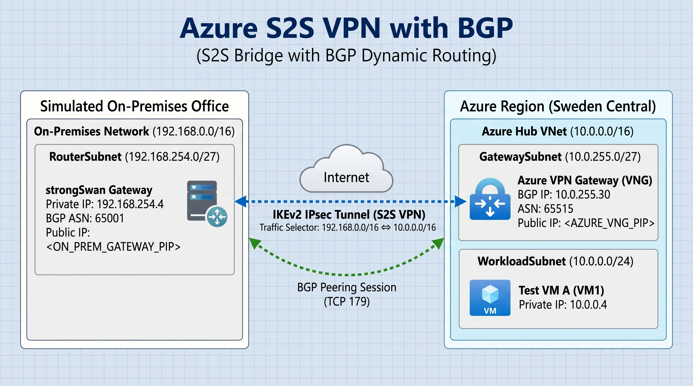

<div align="center">

# Hybrid Cloud Site-to-Site VPN with Dynamic BGP Routing
### Azure Virtual Network Gateway ↔ On-Premises Linux strongSwan & FRRouting


<br/>

[]()
[]()
[]()

</div>

---

## Architecture Topology

<div align="center">
  
</div>

> [!NOTE]
> All sensitive cloud identifiers, SSH keys, credentials, and routable public IP addresses have been completely scrubbed and replaced with standard RFC/placeholder references (`<AZURE_VNG_PIP>`, `<SWAN_PIP>`)[cite: 8].

---

## Network Parameter Matrix

| Parameter | Azure Hub Network | Simulated On-Premises (Branch) |
| :--- | :--- | :--- |
| **Platform** | Microsoft Azure (`swedencentral`) | Linux VM (`Ubuntu 24.04 LTS`) |
| **Virtual Network / Subnet** | `10.0.0.0/16` | `192.168.0.0/16` |
| **Gateway Subnet / Private IP** | `10.0.255.0/27` | `192.168.254.4` (Router VM) |
| **Workload Test Subnet** | `10.0.0.0/24` (`VM1`: `10.0.0.4`) | `192.168.0.0/24` |
| **BGP Autonomous System (ASN)** | `65515` | `65001` |
| **BGP Peering IP** | `10.0.255.30` | `192.168.254.4` |
| **Public Endpoint Reference** | `<AZURE_VNG_PIP>` | `<SWAN_PIP>` |

---

## Repository Structure

```text
├── diagrams/
│   └── architecture.jpg           # Clean visual topology map
├── docs/
│   └── Runbook.pdf                # Production engineering runbook
├── iac-templates/
│   └── finals2s.sanitized.json    # ARM template export
└── strongswan-configs/
    ├── frr.conf                   # BGP dynamic routing daemon config
    ├── ipsec.conf                 # IKEv2 / IPsec Child SA definitions
    ├── ipsec.secrets.example      # Wildcard PSK template
    └── strongswan.conf            # Charon daemon parameters (route protection)
